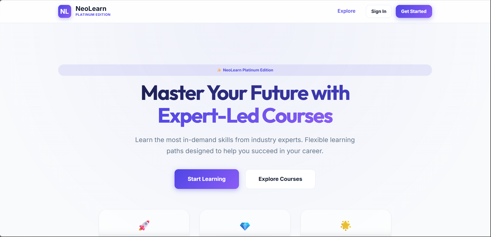

# 💎 NeoLearn LMS: Platinum Edition



---

## 🚀 Transforming Digital Education Through a Premium Learning Ecosystem

**NeoLearn LMS** is a full-stack, enterprise-grade Learning Management System developed for the **Synapse 2K25 Hackathon** by **Team TechTrack**.

NeoLearn revolutionizes online education through:

- Secure role-based academic management  
- Gamified student progression  
- Intelligent assignment ecosystems  
- Professional instructor curriculum tools  
- Platinum-grade UI/UX  
- Real-world deployment scalability  

### 🎯 Core Vision:
To create a scalable, engaging, and production-ready educational platform that bridges modern technology with academic excellence.

### 🎓 Designed For:
- Students seeking structured learning paths  
- Teachers managing curriculum efficiently  
- Institutions requiring a professional LMS solution  

---

# 🌍 Live Deployment

### 🔗 Frontend (Vercel)
[https://neolearn-team-tech-track.vercel.app/](https://neolearn-team-tech-track.vercel.app/)

### 🔗 Backend API (Render)
[https://neolearn-techtrack-backend.onrender.com/ping](https://neolearn-techtrack-backend.onrender.com/ping)

---

# 🚀 Team TechTrack (Synapse 2K25)

### Team Name:
**TechTrack**

### Team Members:
- **Team Leader:** C Gaganasree  
- **Core Developer & Platinum Finalization:** Nanda Gunasri  
- **Member:** Doguparthi Meghana  
- **Member:** Athina Jahnavi  

### Institution:
**Mohan Babu University**

---

# 🧩 Problem Statement

Traditional educational platforms often suffer from:

- Poor UI/UX  
- Weak teacher tools  
- Limited assignment workflows  
- Low student engagement  
- No gamification  
- Fragmented learning systems  
- Weak scalability  

---

# 💡 Our Solution

NeoLearn delivers:

- Course management  
- Teacher tools  
- Student progress tracking  
- Assignments & grading  
- Resources & forums  
- XP, badges, and gamification  
- Real-time notifications  
- Secure cloud deployment  

---

# 🛠️ Tech Stack

## Frontend:
- React.js  
- Vite  
- HTML5  
- CSS3  
- Glassmorphism Platinum Design System  

## Backend:
- Node.js  
- Express.js  

## Database:
- SQLite (Production-optimized)  
- MySQL / MongoDB scalable  

## Security:
- JWT Authentication  
- Bcrypt Password Hashing  
- Role-Based Access Control (RBAC)  

## Deployment:
- Vercel (Frontend)  
- Render (Backend)  

---

## 📂 Project Architecture
```text
├── backend/
│   ├── routes/          # Auth, Courses, Assignments, Grades, Notifications...
│   ├── middleware/      # Role-based Access Control (RBAC)
│   ├── db.js            # Platinum Schema Initialization
│   └── server.js        # Production-ready Express Server
└── frontend/
    ├── src/
    │   ├── context/     # Auth & Identity Management
    │   ├── pages/       # High-fidelity Platinum Dashboard, CourseDetails...
    │   ├── services/    # Optimized API Integration
    │   └── styles.css   # Platinum Design System (Glassmorphism)
```

---

## 🏆 Judge's Audit Guide (Test Flows)
1. **Registration**: Join as a **Student** or **Teacher** to experience the personalized role-based UI.
2. **Onboarding**: Encounter the high-fidelity "Welcome Splash" featuring intelligent facts and platform tips.
3. **Curriculum Delivery (Teacher)**: Create a course → Add a Resource → Post an Assignment.
4. **Learning Journey (Student)**: Enroll in a course → Download Resources → Submit an Assignment.
5. **Assessment Loop**: (Teacher) Grade the submission → (Student) Receive an Achievement Badge & Notification.
6. **Community**: Participate in the **Nexus Forum** to see collaborative learning in action.

---

## 🔒 Security & Performance
- **RBAC**: Strict Role-Based Access Control on all administrative API routes.
- **Defensive Rendering**: Comprehensive optional chaining and state fallbacks to ensure zero-crash performance.
- **Optimized SQL**: Foreign-key indexed tables for high-speed data retrieval.

---

**Developed with ❤️ for Synapse 2K25.**  
**Final Platinum Edition refined, enhanced, and production-polished by Nanda Gunasri.**